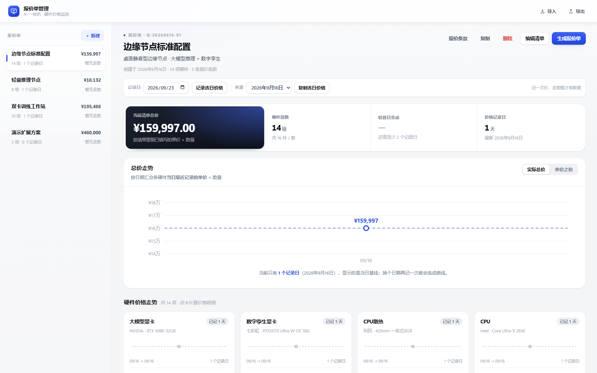

# AI 一体机 · 报价单管理 / 价格监控（TypeScript · 零依赖纯前端）

针对「AI 一体机 · 硬件价格监控」场景的纯前端报价单管理与价格追踪工具。管理多张报价单（硬件清单、单价×数量小计、历史价格走势、报价条款），并一键生成适合打印 / 存档的报价单（PDF）。

> 由旧版单文件（纯 JS）重构而来：现代 **TypeScript** 工程、ESM 模块化、esbuild 打包、vitest 回归测试，界面按 **「Quiet Precision · 冷静精密」** 重新设计（冷调中性底色 + 纯白面板 + 单一钴蓝强调色，靠留白、字重与极浅描边建立层次）。

## ✨ 功能

- **开箱即用**：首次打开自带 3 套示例配置（边缘节点标准配置 / 轻量推理节点 / 双卡训练工作站），含真实价格与历史走势，可直接体验或在此基础上修改
- **多报价单管理**：新建 / 复制 / 删除 / 侧栏切换，名称、备注就地编辑
- **硬件清单编辑**：表格化录入（名称、品牌、型号、参数、数量、单位、单价、商品链接），合计自动计算，支持上下移 / 删除
- **价格追踪**：改单价自动记当天、按日期补录历史价、同一日期覆盖不重复堆叠；总价走势 + 单项明细弹窗（统计卡 / 折线图 / 环比表 / 补录表单）
- **一键复制某日价格**：选好目标日期（如 9.17），点「复制上一日价格」即可把最近一个有记录的价格日（如 9.16）的每项价格复制过去，省去重复录入
- **走势口径**：`实际总价`（单价×数量）与 `单价之和` 可切换
- **报价条款**：不写死，每张报价单独立维护，原样出现在报价单上
- **生成报价单**：一键打印 / 另存为 PDF，含单价、小计、金额大写、条款、签署栏
- **数据安全**：全部保存在浏览器 localStorage（本地），支持 JSON 一键导出 / 导入备份，兼容旧版单文件数据自动迁移
- **离线可用**：无第三方运行时库、无 CDN，`dist/` 整个文件夹拷走即可用，双击 `index.html` 直接打开

## 🎨 界面设计（Quiet Precision · 冷静精密）

- **一块画布，一个强调色**：冷调中性底（`#F4F5F7`）+ 纯白面板，全局只用一个钴蓝 `#2B50E8`，且只给主操作 / 交互态 / 金额数字，绝不铺大面积色块
- **层次不靠颜色靠秩序**：统一圆角梯度（6/9/12/16/20px）、真实 1px 极浅描边（`#ECEEF2`）、克制的两级投影，卡片之间只有留白与发丝线
- **导航栏**：半透明白 + `backdrop-filter: saturate(180%) blur(20px)` 毛玻璃，滚动时内容在其下柔和淡出
- **KPI 合并成一块白板**：左侧深色渐变 hero 放总价，右侧三格用 1px 竖线分隔，不再是一堆各自带色的卡片
- **排版**：SF Pro / Segoe UI Variable / PingFang SC 系统字体栈，标题 700 + 紧字距，小标签 10.5px 加宽字距；所有金额数字 `tabular-nums` 对齐
- **语义色只落在数字上**：涨红跌绿（`#D93B3B` / `#0F9D63`）、持平用中性灰，不用红绿背景块
- **表格即表单**：单元格悬停才浮出浅底与描边，聚焦时钴蓝描边 + 柔光圈；长参数自动撑高、超过三行截断并挂 `title` 提示
- **弹窗 / 条款 / 报价单**：同一套令牌与节奏，报价单打印版保留独立排版（金额大写、条款、签署栏）
- 桌面 / 移动端自适应（窄屏侧栏变顶部横排卡片），尊重 `prefers-reduced-motion`



## 🧱 技术栈

| 项 | 选型 |
|---|---|
| 语言 | TypeScript（strict） |
| 打包 | esbuild → 纯静态 `dist/`（iife 单文件，可 file:// 直接打开） |
| 测试 | vitest + jsdom（14 组回归）+ 构建产物冒烟 + Playwright/Chromium UI 审计 |
| 图表 | 自研手写 SVG（零依赖） |
| 存储 | localStorage |

## 📁 目录结构

```
├── index.html            # 页面骨架（构建时原样复制到 dist/）
├── src/                  # TypeScript 源码
│   ├── main.ts           # 入口（引入样式 + 启动）
│   ├── app.ts            # 应用控制器：模式切换 / 渲染调度 / 导入导出
│   ├── appRef.ts         # 视图访问控制器的桥（避免循环依赖）
│   ├── types.ts          # 数据模型类型
│   ├── util.ts           # 金额 / 日期 / 字符串 / 提示工具
│   ├── charts.ts         # SVG 图表引擎（折线 + 迷你走势）
│   ├── store.ts          # 数据层：持久化 / 计算 / 旧版迁移
│   └── views/            # 视图：sidebar / dashboard / editor / modal / terms / quoteDoc
├── styles/               # 设计令牌与样式（tokens / layout / components / print）
├── scripts/              # build / preview / snapshot / audit-ui
├── tests/                # vitest 回归测试 + 构建产物冒烟测试
└── dist/                 # 构建产物（可直接使用 / 部署）
```

## 🚀 快速开始

```bash
npm install          # 安装依赖
npm run verify       # typecheck + 测试 + 构建（一键全绿）
npm run build        # 构建 dist/
npm run watch        # 监听 src & styles 增量构建
npm run preview      # 本地静态预览 http://127.0.0.1:4173
npm run test         # 运行回归测试
npm run test:watch   # 测试监听模式
node tests/smoke-built.mjs   # 冒烟：验证 dist 产物能正常启动
node scripts/snapshot.mjs    # 生成带演示数据的预览页
node scripts/audit-ui.mjs    # 真实浏览器（Chromium）布局与样式审计 + 截图
```

构建完成后直接用浏览器打开 `dist/index.html` 即可（无需服务器、无需联网）。

### GitHub Pages 部署（可选）

把 `dist/` 内容发布到 Pages 即可；或执行：

```bash
npx gh-pages -d dist
```

## 💾 数据

- 存储键：`ai-quote-v1`（数据）、`ai-quote-prefs`（走势口径偏好）、`ai-quote-mode`（视图模式）
- 旧版单文件版数据（`ai-hardware-price-v1`）首次打开自动迁移
- 定期用顶栏「导出 JSON」备份；「导入 JSON」可恢复

## 📝 打印 / PDF

「生成报价单」→ 浏览器打印预览 → 选「另存为 PDF」。报价单上的条款取自【报价条款】弹窗，按需增删改；未填单价的项目显示「未报价」且不计入合计。

## 🤝 License

[MIT](LICENSE)